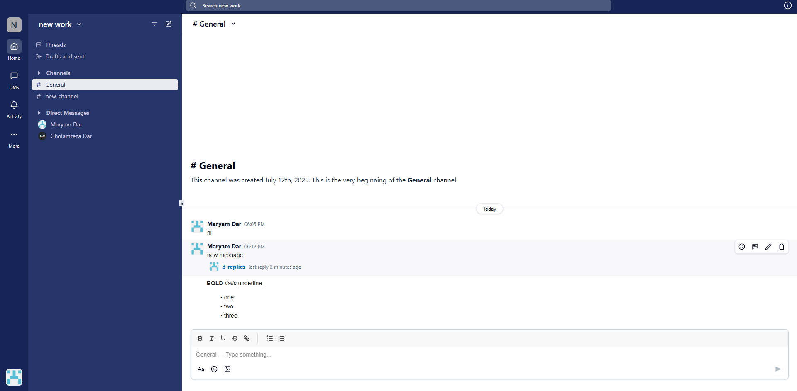

# Slack Clone

A modern Slack-like chat application built with **Next.js (App Router)**, **TypeScript**, **Tailwind CSS**, and **Convex** for realtime backend and authentication.

> **Live Demo:** [View on Vercel](https://slack-clone-app-mu.vercel.app)

---

## Pages

### workspace 


### thread and reply


### private chat


### search


---

##  Features

**Authentication**
- Sign up & login securely (Convex Auth)

**Workspaces**
- Create new workspaces
- Edit workspace details
- Delete workspaces
- Invite people to join
- Leave workspace

**Channels**
- Create channels inside workspaces
- Send, edit, delete messages
- Reply to messages & view threads

**Private Conversations**
- Start private chats between two people
- View and manage threads of private messages

**User Management (Admin)**
- View member profiles
- Change roles (e.g., member, admin)
- Remove members from workspace

---

##  Built With

- [Next.js (App Router)](https://nextjs.org/)
- [TypeScript](https://www.typescriptlang.org/)
- [Tailwind CSS](https://tailwindcss.com/)
- [Convex](https://convex.dev/) (Realtime data & auth)

---

## 📦 Installation

```bash
# Clone the repository
git clone https://github.com/your-username/slack-clone.git
cd slack-clone

# Install dependencies
npm install

# Create .env.local from example and add environment variables
cp .env.example .env.local

# Start the development server
npm run dev
```

## Author
[MaryamDar](https://github.com/marydar)

